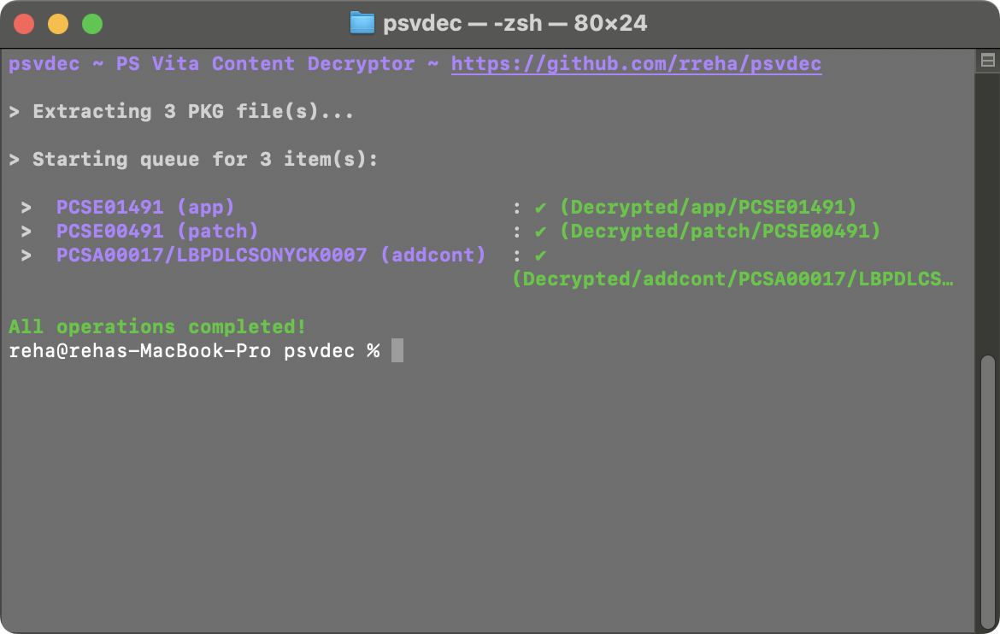

# psvdec (formerly psvcdc)
<p align="center"></p>
A Python program that helps with PS Vita content (games, updates, DLCs) decryption.<br>

# Download
Check out the **[latest release page](https://github.com/rreha/psvdec/releases/latest)**.

# Installation & Usage
## Installation
You need to have Python installed.<br>

**FOR WINDOWS: You have to install [Visual C++ Redistributables](https://aka.ms/vs/17/release/vc_redist.x64.exe) in order to run psvpfsparser which is required by psvdec to work properly.**<br>

Clone the repository and install required modules:<br>
```
git clone https://github.com/rreha/psvdec
cd psvdec
pip install -r ./requirements.txt
```
## Usage
```bash
python main.py [inputs ...] [options]
```

| Argument       | Description                                                                        |
|----------------|------------------------------------------------------------------------------------|
| `[inputs ...]` | One or more PS Vita .pkg files or extracted folders (app, patch, addcont)          |
| `-o / --out`   | Specify a custom output directory for the decrypted content (default: ./Decrypted) |
| `--no-eboot`   | Disable eboot.bin decryption                                                       |
| `--update-db`  | Force the script to download the latest zRIF databases from NoPayStation           |
| `-h`, `--help` | Show the help message                                                              |


# Binary Sources
## psvpfsparser
Windows and Ubuntu binaries were taken from the [psvpfstools release](https://github.com/motoharu-gosuto/psvpfstools/releases/latest).<br/>
The MacOS binaries were built by me using [my psvpfstools fork](https://github.com/rreha/psvpfstools).

# Credits
Contributors of NoPayStation for **[NoPayStation](https://nopaystation.com/)**.<br>
st4rk for **[PkgDecrypt](https://github.com/st4rk/PkgDecrypt)**.<br>
motoharu-gosoto for **[psvpfstools](https://github.com/motoharu-gosuto/psvpfstools)**.<br>
uyjulian for the **[fork of psvpfstools](https://github.com/uyjulian/psvpfstools)**.<br>
Team Molecule for the **[sceutils](https://github.com/TeamMolecule/sceutils)**.<br>
mathieulh for the **[sceutils fork with proper keys](https://github.com/mathieulh/sceutils)**.<br>
Yoti for the **[fixed fork of mathieulh's sceutils fork](https://github.com/RealYoti/sceutils/tree/master)**.<br>
